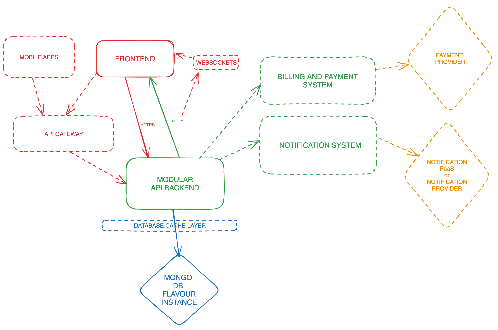

# Technical Roadmap

## Project Mission

To create a platform that allows users to organise public and private picnics.
The revenue would be generated from paying subscribers that would allow them to access the organisation of private picnics.
Concentrate in a geographical market in the beginning to simplify the infrastructure needs.

### Product considerations

The project has some of the following caveats due the nature of the product:
- the usage would be highly seasonal due to
    * cold months
    * unlikely users will be doing frequent picnics

This will create some particular needs to consider, for example in the infrastructure side as we will need to meet the demands elastically.
Also the development and the initial launching of the MVP should match the warm season. Probably, it would be a good idea to choose a geographical launching location with a longer warm season for a wider time range of usage that will lead to analytics data on how to evolve the product and how to achieve product market fit (PMF).
If we consider a goal subscription of $5/month for every paid user, that would mean getting at least 20k users that pay for one month in the whole year to achieve an ARR of $100k, which is very typical in the first year of a startup. So let's assume a warm season of 6 months. That would say to us that in order to achieve our expected ARR we would need more than 3k paid users per month.
So the potential % of free users against paid users would be 10:1 on an assumption basis, that would make us to tend to have 33k users per month.

The geographical location of the launch needs the following characteristics:
- Longer warm seasons
- Multiple outdoors, parks, forests, lakes, beaches, ...
- Society's economic level that allows people to spend $5 to create private picnics in the future.
- Area of influence of at least 50 million of population so our monthly goal would be to achieve a 0.006 % of its population as user.

Based on the geographical location we can decide where the infrastructure should be located for the MVP and early stages of the product before expanding.

Regarding the number of requests we could face based on the $33k users:
- Let's guess 5 operations for user registration.
- Creating a picnic (1 operation)
- Creating a list of picnic supplies (let's assume 5 operations)
- Sending RSVP (average 10 attendees) to the picnic (1 operations)
- Invited people accessing to the list multiple times (3 times * 10 * 1 op = 30 ops)

Calculating a flat 50 ops per picnic (that would cover the previous scenario), and considering each user can create one picnic per month we could have a tentative operations calculation of:
50 ops/picnic * 1 picnic/month * 33k users = 1.65 million ops/month

Regarding user concurrency they will be all based on the same timezone so we won't have an even distribution of the load during the day and will concentrate in the day hours.
Based on our consideration that every user will make 1 picnic per month and it is highly likely they will do it during the weekends we can assume that the biggest concurrency will happen around the days close to the weekend when users will double check everything is prepared.
Assuming 8 days of weekend per month, we will have about 4125 picnics per month, with an average of 10 attendees per picnic, so around 41k users. Also assuming an evenly distribution of access to the WebApps in the early hours of the day for the preparations and details, we can assume 10k users per hour.
With this I can come with an average of 3 concurrent users per second, giving it a small buffer, but certainly with spikes based on the most typical hours for a picnic.

## Milestones

### 1 month

- Finalisation of the Development environment
- CI/CD basic integration
- Features accomplished: picnic feature, picnic list feature, picnic activities feature, picnic localisation feature

### 2 months

- Features accomplished: picnic invites feature, picnic share actions feature, early notification system

### 3 months

- Finalisation of the Production environment
- Observability tools with basic dashboards and metrics to handle minimal on-call in place
- Features accomplished: user registering feature, OAuth feature, initial private dashboard feature 

### 4 months

- Beta version made public in production. Users can register, create picnics and share them with their invitees.
- Features accomplished: RBAC (picnic owner, picnic invitees) implementation feature, continuation of work in the private dashboard feature
- Analytics events system in place to start consuming data but injecting it inside of New Relic (check tech stack analytics point)

### 5 months

- Features accomplished: permissions system feature as continuation of the RBAC feature (all existing features have a private counterpart and are RBAC configured)
- Infrastructure work in rate limiting to avoid production to be taken down when more accessible

### 6 months

- Finalisation of MVP: Currently only free users that have access to the functionalities of public picnics
- Marketing phase: efforts to gain traction and user acquisition by SEO tasks, paid advertising and social media
- Start of on-call rota based on the early usage data gathered in observability tools during the last 2 months
- Review of the existing platform to understand missing features in case of having to reshape the roadmap
- Tech debt facelift

### 7 months

- Features (private): billing feature, payment integration feature
- Infrastructure planning for scalability, review of performance bottlenecks and pain points. Set a plan for platform evolution.

### 8 months

- Features (public): more robust notification system
- Tech debt and features fixes.

### 9 months

- Features (private): comments feature public
- Features (public): block/report users feature

### 10 months

- Features (private): photo uploading feature, photo sharing feature, improve invitees handling feature (sync with contacts from email, etc)

### 11 months

- Features (private): historic picnics feature, create picnic based on existing one feature, search in picnics functionality feature

### 12 months

- Finalisation of all minimum features for private picnics.
- User growth is starting to be organic and less dependent on advertising and referrals.
- Reach goal ARR for the first year.

### > 1 year

- Explore expansion to other geographical markets to increase revenue.
- Increase private features and think in multilanguage/multimarket features roadmap
- Infrastructure review of needs to replicate in other regions based on launch places

# Team

## Composition

- 1 x Product Manager
- 1 x Lead Developer (hands on)
- 2 x Full Stack Engineers
- 1 x DevOps Engineer

# Deadlines and budget

Particularly the deadlines are going to be very well coupled to the runway of the company based on the project's funding and the ARR goals.
Let's aim for a $100k ARR, as it is a typical goal for a startup in the first year.

## Budget

### Team costs

For team costs calculation let's go for a flat level structure compensation. Also considering the tools chosen have a widely available talent pool for being not niche.

Team costs - $510k/year
- Product Manager: 1 x $100k
- Lead Developer: 1 x $110k
- Full Stack Engineers: 2 x $100k
- DevOps Engineer: 1 x $100k

Equipment costs - 5 x $3k = $15k/year (initial investment, will decrease)

### Infrastructure costs

- GitHub Teams: 4 seats -> $16/month -> $192/year

- [GitHub Actions](https://github.com/pricing/calculator?feature=actions)
2 environments but only running workflows in Development
2 Workflows (E2E FE Test, E2E BE Test)
4 Developers * 3 tasks per day as average * We estimate 5 job execution based on PR reviews and/or mistakes = 60 jobs/day -> $216.00 + $72.00 = $288/month -> $3456/year

- New Relic: $0

- AWS Document DB
db.t4g.medium 4 GB /  2 vCPU - $0.076/hour -> $54.72 / month
Storage: $0.10 per GB/month -> 50 x 0.10 = $5/month
I/O: $0.20 per million requests - Having calculated average of 1.65 million ops/month earlier and buffer it a bit -> $1/month 
Total = $60.72 / month -> $783.36/year

The Development database shouldn't have that much of information nor traffic so we round budget database cost to $1k/year

- AWS ECS
Giving the previous calculations of concurrent users, considering that Small applications tend to have less than 20 concurrent users.
AWS ECS Anywhere pricing is $0.01025/hour so that means $7.38/month -> $88.56/year 

As we would need 4 instances (2 per WebApp per environment) that would be a total of: $354.24
As I am missing certain details and probably costs associated, I am going to round up to $1k/year to be on the safe side. However more detailed calculations and investigation of the price ranges for the instances must be done.

Estimated infra costs: ~ $6k

### Total

Budget of about $531k/year.

### Break even

The budget implies 106200 yearly subscriptions of $5 each to break even. 8850 subscriptions/month.
This is quite close to the first year ARR goal of $100k and would allow with the right evolution profit of the company in the second year of life.
Unfortunately the B2C space is very difficult to growth without some advertising investment and I haven't contemplated that yet in the figures, so profitability right now is not accurately calculated.

# Tech stack

## Frontend
### Choice

* React *

### Reason

Even if libraries like jQuery are still dominating the usage in the Web (due mostly to technology outdated WebApps), React has a wide implementation with many OSS libraries that implement plug and play components allowing quick development of UI.
Additionally currently the developer pool with React expertise is very wide, so for hiring purposes it will allow easier hiring.

## Backend
### Choice

* Node.js *

### Reason

Similar to the reasoning behind the choice in the Frontend.
Currently for quick backend implementations, I find that considering the talent pool, the speed of request handling that Node.js offers because of its architecture, Node.js is still a great tool to use.
There are currently multiple frameworks from basic (Fastify, Express.js) to advanced (Nest.js) that have the minimal structure to able to create WebApp API backends without having to customise everything.
I'd probably commit to a decision based on the talent pool available and the skills and experience of the team.
Also sharing the same language as the Frontend helps to allocate developer resources in both areas as needed.

### Runner up

Next.js would be a choice, but unfortunately the deployments so far will be limited to use the Vercel platform. As I have no experience with Vercel, I can't ponder on how good of a move it would be, but I am concerned with vendor lock-ins and future migration problems.
However the seamless experience of Next.js and how quickly you can develop a WebApp could be a strong indicator to go for it. Something to consider.

## Database
### Choice

* NoSQL flavour database *

### Reason

Flexibility on the schema in the early stages of the product allow drastic changes if needed without having to overwork in schema transitions or having to do painful schema migrations.
At this early stages the performance results are going to be based more on the use cases implementation and queries than on the tool selected.
One negative thing of this choice is that it can make consistency of graph related needs worse (considering intertwined relationships between data from the social network aspect of the project), due NoSQL nature and solution.
However as I do not have solid experience with Graph databases I'd rather be conservative in this area and in the future when growing the team consider moving the features needed to a graph database by hiring someone with expertise in that field.

Probably the choice would be AWS Document DB as it is compatible with MongoDB and we could think which PaaS to go to based on the pricing (AWS vs MongoDB Atlas)

### Runner up

Graph database.

## Testing tools
### Choice

* Playwright *

### Reason

In the testing area I would focus on E2E testing to cover as many codebase areas as possible with minimal effort, implement testing for the use cases implemented in the Frontend WebApp and in the Backend API. Therefore we will have 2 workflows for the test runner, one for frontend and one for backend.
I never tried Playwright but the general consensus and based on experience the current main options used (Cypress, Selenium) are flaky and not the best developer experience. So even though it is needed to explore other options for now I would choose Playwright.
Some of the reasons are:
- it is OSS
- is Node.js based so it is close to the chosen tech stack.
- it supports multiple other languages in case of changing part of the tech stack
- it allows targeted testing for browser engines: Chromium, Webkit, and Firefox
- can handle multiple tabs and easy to test iframes
- it has GitHub Actions integration
- it can be used individually without CI/CD through Docker images
- it is quicker and better memory management than Cypress (based on other developers feedback)

## Repository
### Choice

* GitHub *

### Reason

Cloud managed repository, being the most popular choice for startups / scaleups, when there is no budget for a self hosted solution.
Integrates nicely with other SaaS through OAuth so leverages the privacy and security tasks of limiting access to other tools.
Allows easy team management based on seats. Based on the team composition, we would only need 4 seats.

## CI/CD
### Choice

* GitHub Actions *

### Reason

Quick integration with GitHub repositories.
Our aim is to implement continuous delivery for a quick developer experience so it seems sensible to use as many tools as possible that easily integrate between themselves. This will allow quicker deployments to the different environments.

### Runner Up

When team workload and composition would allow it, I'd choose to move on to Concourse CI, self hosted and managed. This is because it is OSS and the cost to manage should be cheaper than using an external solution.

## Hosting
### Choice

* AWS *

### Reason

It has been proved that AWS is more reliable in the long run, with high standards for uptime, besides the technical support I have experienced is very good.
Additionally engineers that are not DevOps savvy tend to have the most exposure to AWS products and tools. So for hiring, the talent pool will be wider compared to Azure, that is more oriented to enterprises, and to Google Cloud, that is more oriented to developer experience.
Worth noting that consistency of Google Cloud products is not very good and can compromise uptime of the services, besides engineering time waste trying to implement workarounds while technical support fixes or investigates the problems. I have experienced blockers of more than one month causing harm to the business.
I would also avoid PaaS such Heroku, that rely on AWS, but the reliability and the support speed is not very good. I personally do not find the Developer Experience better than using AWS directly, so I'd rather cut the intermediaries. Hence the choice of adding a DevOps engineer to the team composition to help in this area.

For the MVP and initial user traction as minimum we would need to have 2 AWS ECS, with one instance for the Frontend WebApp and another for the Backend WebApp. Using AWS ECS allows us to create Docker instances for both WebApps that can be reused in the CI/CD test runners and in local development, helping the development confidence.
Furthermore, AWS ECS has automatic scaling features which are helpful in case of bursts of requests or an exponential growth in the usage.

## Observability
### Choice

* New Relic *

### Reason

This decision is purely based on economic terms.
I personally prefer Datadog because the analysis tools and the dashboard visualization options but in terms of features both PaaS are very close.
New Relic offers a free subscription tier through a one platform user and 100 Gbs of data. As the user can be shared by a common developer account and considering the continuous delivery approach, we can leave aside the need of data and log retention, minimising the amount of data used and squeezing as much as possible the free tier in the initial stages of the product. 
Integration with JavaScript codebases is straight forward and offer monitoring up to the lowest level, helping to identify potential bottlenecks based on not great code implementations.

### Runner up

Datadog.

## Analytics
### Choice

Use a combination of the tools chosen New Relic / data stores in the databases to analyse patterns and usage, until a more specific need requires us to hire a specialist and build a proper system in place or to use PaaS like Mixpanel or others.
I am cutting corners here even though event analytics is important but in early stages New Relic provides enough tools for basic information while the company doesn't enter its growth phase.

# Architecture

## Diagram

This is a representation of the short term architecture (solid lines) and a medium-long term architecture (dashed lines).

The basic architecture at the start will be comprised of a Frontend WebApp based in React.js, a Modular Backend API WebApp and a MongoDB flavour database instance. The protocol used for exchange of information would be HTTPS with the possibility of define the interfaces with TypeScript for shared purposes and with a API documentation generator.
The Modular Backend API will allow to extract individually domain areas of the backend to live in dedicated services or be replaced by integrations with PaaS. Clear candidates are the Billing and Payments module and the Notifications module in a medium term. Another candidate would be the Auth module that is not pictures in the diagram.

In the medium term other areas of improvement would be:
- Implementation of WebSockets communication to the frontend clients to allow a greater UX and interactivity.
- Implementation of a Database Cache Layer to improve the performance of the instances to try to delay the scale out that would incur in greater infrastructure costs. Would be sensible to compare the cost calculation.

In the long term other areas of improvement would be:
- Creation of mobile application to offer great services to the users.
- Implementation of an API Gateway to handle all the available clients of the Backend (Mobile, Frontend WebApp)
- (Missing from the diagram) Integration with Analytics PaaS
